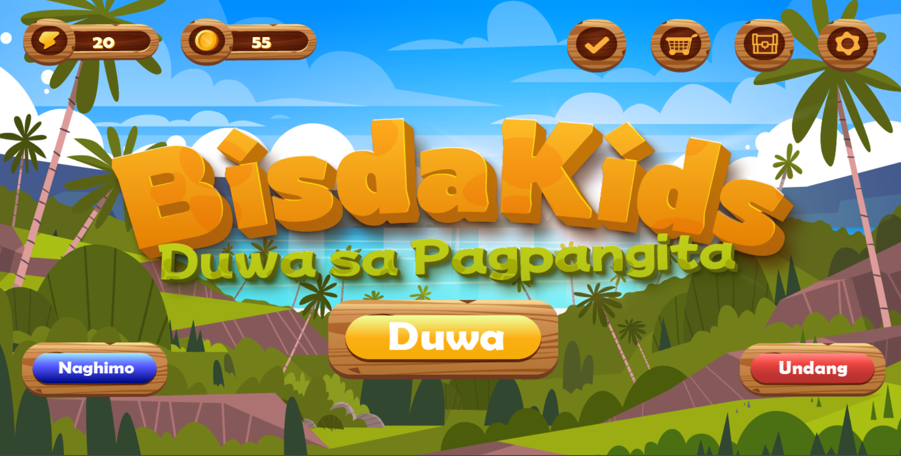
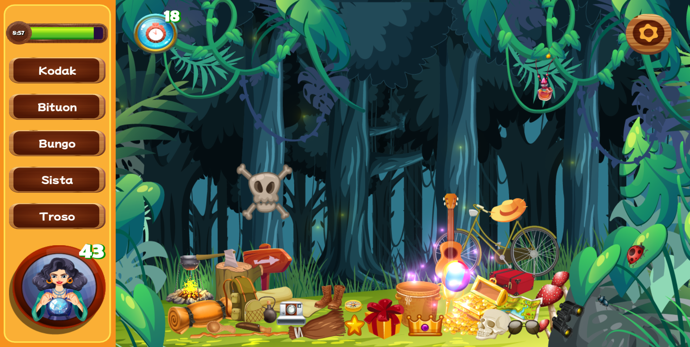
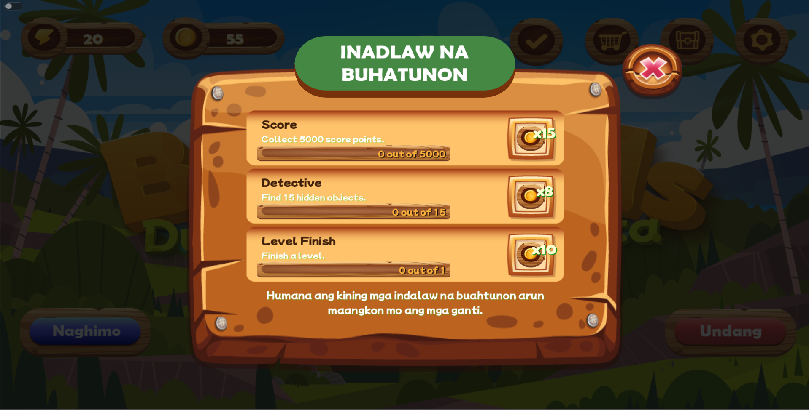

# Bisdakids: Duwa sa Pagpangita 
### A sinugbuanong Binisaya mobile game applciation designed for improving the proficiency of Bisaya children. 

Premise: Bisaya young children nowadays are exposed to the various english multimedia entertainment such as Peppa Pig, Cocomelon, and more. Because of this, they are more proficient in the english language rather than their native tongue of bisaya.  

## Main Menu

The entire game interface is immersed in Sinugbuanong Binisaya, providing players with an authentic language experience. 
## Gameplay

Immerse yourself in a vibrant world filled with objects in Bisaya! Each item comes with a word definition and a pronunciation guide, ensuring an enriching learning journey. While the picture above depicts level 1, reaching level milestones like 5 unlocks the unique boss stage, adding a fresh twist to the classic hidden object gameplay. 
## Daily Task and other features

Daily tasks keep players engaged, giving them a reason to return for more fun and learning. Explore other exciting features like shops, inventory, and stay tuned for more updates!
 
## Technology Stack
* Game Engine
  * Godot 4
* Programming Language
  * GDScript 4
  * PHP (for the API)
* Graphics
  * Adobe Illustrator
* Database (Cloud-hosted, Supabase)
  * PostgreSQL
* API
  * Home-brewed PHP API (Game to Database communication)
* Documentation
  * LaTeX    

## OUR TEAM
Dwight Eyac - Project Manager, Technical Manager, Backend Engineer, Database Admin 

Gero Monica Alcover - Graphic Arts Lead, Frontend Engineer, Game Designer 

Moses Anthony Fat - Lead Frontend Engineer, Full-Stack Web Engineer, Software Developer 

Kimberly Paradero - Full-Stack Developer, Frontend Engineer, Systems Analyst 

John Carl Villanuvea - Audio Engineer, Bisaya Words, Graphic Artist 

## 
Short Explainer Video Link: [youtube link](https://www.youtube.com/watch?v=kKcznEgS6o0)
